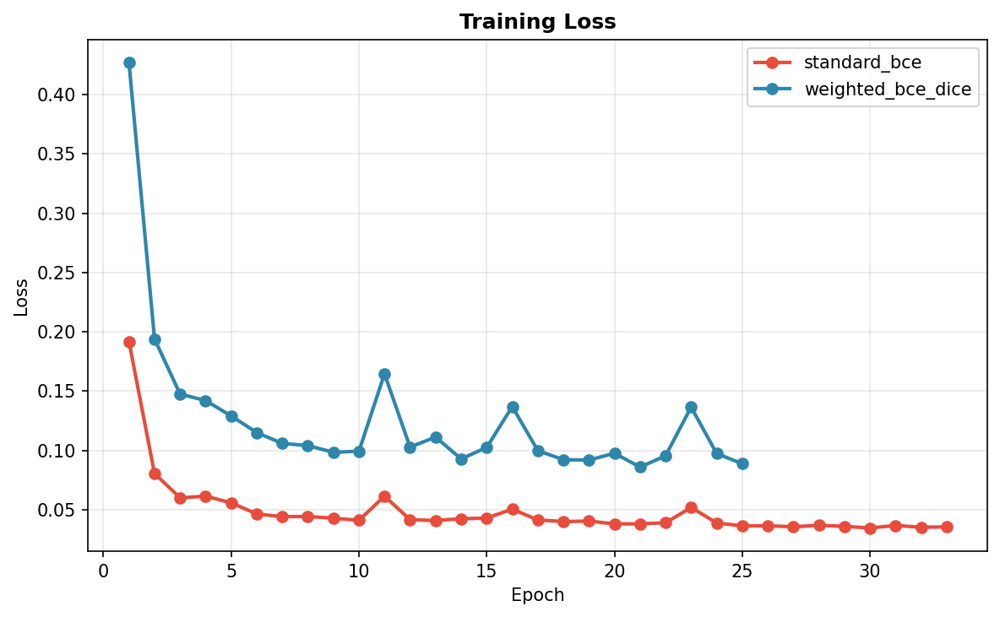
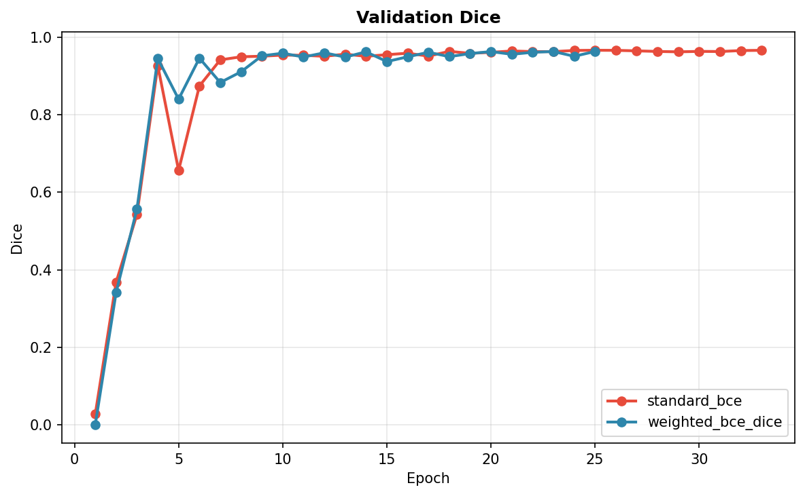
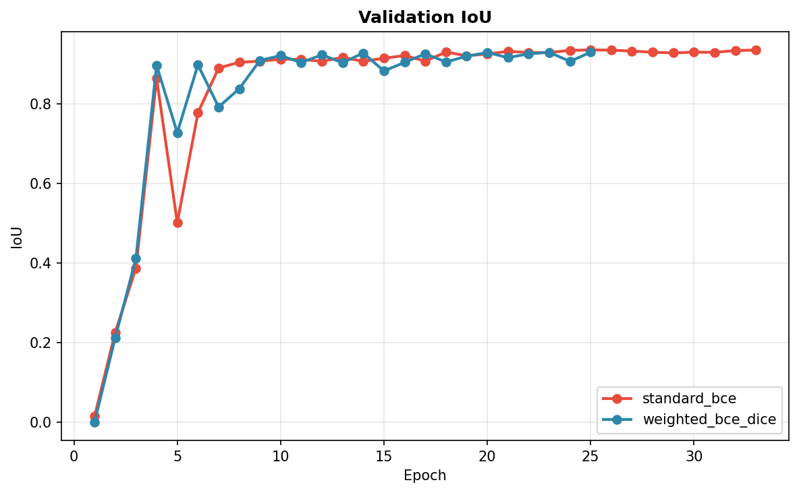

Semua file perbandingan sudah tersedia.
Device: cuda
GPU: Tesla T4

============================================================
EXPERIMENT: standard_bce
============================================================
Dataset: 347 samples, binary (bg + leaf)
Train: 313  Val: 34
[wandb] init failed (init() got an unexpected keyword argument 'finish_previous') — continuing without tracking
Epochs: 100, Early stop patience: 15, Delta: 0.005
------------------------------------------------------------
Epoch   1/100 | Loss: 0.1919 | Val Loss: 1.6404 | IoU: 0.0146 | Dice: 0.0282
  ★ New best Dice: 0.0282
Epoch   2/100 | Loss: 0.0806 | Val Loss: 0.3919 | IoU: 0.2257 | Dice: 0.3679
  ★ New best Dice: 0.3679
Epoch   3/100 | Loss: 0.0601 | Val Loss: 0.7733 | IoU: 0.3866 | Dice: 0.5427
  ★ New best Dice: 0.5427
Epoch   4/100 | Loss: 0.0615 | Val Loss: 0.1165 | IoU: 0.8633 | Dice: 0.9266
  ★ New best Dice: 0.9266
Epoch   5/100 | Loss: 0.0559 | Val Loss: 0.6132 | IoU: 0.5004 | Dice: 0.6562
[WARN (D)] IoU anjlok drastis: 0.8633 → 0.5004 di epoch 5. Cek prediksi di results/standard_bce/predictions.
Epoch   6/100 | Loss: 0.0465 | Val Loss: 0.2247 | IoU: 0.7769 | Dice: 0.8740
Epoch   7/100 | Loss: 0.0442 | Val Loss: 0.0907 | IoU: 0.8893 | Dice: 0.9413
  ★ New best Dice: 0.9413
Epoch   8/100 | Loss: 0.0444 | Val Loss: 0.0709 | IoU: 0.9036 | Dice: 0.9494
  ★ New best Dice: 0.9494
Epoch   9/100 | Loss: 0.0429 | Val Loss: 0.0688 | IoU: 0.9063 | Dice: 0.9509
Epoch  10/100 | Loss: 0.0411 | Val Loss: 0.0678 | IoU: 0.9115 | Dice: 0.9537
Epoch  11/100 | Loss: 0.0615 | Val Loss: 0.0677 | IoU: 0.9109 | Dice: 0.9532
Epoch  12/100 | Loss: 0.0417 | Val Loss: 0.0680 | IoU: 0.9060 | Dice: 0.9506
Epoch  13/100 | Loss: 0.0409 | Val Loss: 0.0625 | IoU: 0.9160 | Dice: 0.9561
  ★ New best Dice: 0.9561
Epoch  14/100 | Loss: 0.0425 | Val Loss: 0.0953 | IoU: 0.9059 | Dice: 0.9506
Epoch  15/100 | Loss: 0.0429 | Val Loss: 0.0633 | IoU: 0.9138 | Dice: 0.9547
Epoch  16/100 | Loss: 0.0505 | Val Loss: 0.0734 | IoU: 0.9205 | Dice: 0.9586
Epoch  17/100 | Loss: 0.0414 | Val Loss: 0.0637 | IoU: 0.9066 | Dice: 0.9510
Epoch  18/100 | Loss: 0.0401 | Val Loss: 0.0517 | IoU: 0.9293 | Dice: 0.9633
  ★ New best Dice: 0.9633
Epoch  19/100 | Loss: 0.0405 | Val Loss: 0.0564 | IoU: 0.9199 | Dice: 0.9582
Epoch  20/100 | Loss: 0.0381 | Val Loss: 0.0574 | IoU: 0.9247 | Dice: 0.9608
Epoch  21/100 | Loss: 0.0381 | Val Loss: 0.0501 | IoU: 0.9311 | Dice: 0.9643
Epoch  22/100 | Loss: 0.0391 | Val Loss: 0.0536 | IoU: 0.9282 | Dice: 0.9627
Epoch  23/100 | Loss: 0.0519 | Val Loss: 0.0564 | IoU: 0.9281 | Dice: 0.9627
Epoch  24/100 | Loss: 0.0389 | Val Loss: 0.0527 | IoU: 0.9337 | Dice: 0.9656
Epoch  25/100 | Loss: 0.0364 | Val Loss: 0.0497 | IoU: 0.9346 | Dice: 0.9662
Epoch  26/100 | Loss: 0.0365 | Val Loss: 0.0501 | IoU: 0.9342 | Dice: 0.9659
Epoch  27/100 | Loss: 0.0356 | Val Loss: 0.0555 | IoU: 0.9317 | Dice: 0.9646
Epoch  28/100 | Loss: 0.0369 | Val Loss: 0.0505 | IoU: 0.9289 | Dice: 0.9631
Epoch  29/100 | Loss: 0.0360 | Val Loss: 0.0513 | IoU: 0.9272 | Dice: 0.9621
Epoch  30/100 | Loss: 0.0347 | Val Loss: 0.0526 | IoU: 0.9293 | Dice: 0.9633
Epoch  31/100 | Loss: 0.0368 | Val Loss: 0.0556 | IoU: 0.9285 | Dice: 0.9629
Epoch  32/100 | Loss: 0.0352 | Val Loss: 0.0495 | IoU: 0.9331 | Dice: 0.9654
Epoch  33/100 | Loss: 0.0356 | Val Loss: 0.0478 | IoU: 0.9343 | Dice: 0.9660
Early stopping at epoch 33
  ✓ Saved: best_standard_bce.pth (124.2 MB)
  ✓ Saved: config_standard_bce.yaml
  ✓ Saved: metrics_standard_bce.json

============================================================
EXPERIMENT: weighted_bce_dice
============================================================
Dataset: 347 samples, binary (bg + leaf)
Train: 313  Val: 34
[wandb] init failed (init() got an unexpected keyword argument 'finish_previous') — continuing without tracking
Epochs: 100, Early stop patience: 15, Delta: 0.005
------------------------------------------------------------
Epoch   1/100 | Loss: 0.4272 | Val Loss: 44.4156 | IoU: 0.0005 | Dice: 0.0011
  ★ New best Dice: 0.0011
Epoch   2/100 | Loss: 0.1941 | Val Loss: 1.9014 | IoU: 0.2120 | Dice: 0.3418
  ★ New best Dice: 0.3418
Epoch   3/100 | Loss: 0.1476 | Val Loss: 6.5603 | IoU: 0.4115 | Dice: 0.5567
  ★ New best Dice: 0.5567
Epoch   4/100 | Loss: 0.1421 | Val Loss: 0.1646 | IoU: 0.8959 | Dice: 0.9450
  ★ New best Dice: 0.9450
Epoch   5/100 | Loss: 0.1291 | Val Loss: 1.0303 | IoU: 0.7267 | Dice: 0.8400
Epoch   6/100 | Loss: 0.1151 | Val Loss: 0.2240 | IoU: 0.8972 | Dice: 0.9458
Epoch   7/100 | Loss: 0.1060 | Val Loss: 0.7629 | IoU: 0.7914 | Dice: 0.8830
Epoch   8/100 | Loss: 0.1041 | Val Loss: 0.2481 | IoU: 0.8372 | Dice: 0.9106
Epoch   9/100 | Loss: 0.0985 | Val Loss: 0.1488 | IoU: 0.9083 | Dice: 0.9518
  ★ New best Dice: 0.9518
Epoch  10/100 | Loss: 0.0994 | Val Loss: 0.1213 | IoU: 0.9205 | Dice: 0.9585
  ★ New best Dice: 0.9585
Epoch  11/100 | Loss: 0.1647 | Val Loss: 0.1314 | IoU: 0.9028 | Dice: 0.9487
Epoch  12/100 | Loss: 0.1029 | Val Loss: 0.1240 | IoU: 0.9225 | Dice: 0.9596
Epoch  13/100 | Loss: 0.1113 | Val Loss: 0.1270 | IoU: 0.9023 | Dice: 0.9485
Epoch  14/100 | Loss: 0.0929 | Val Loss: 0.1348 | IoU: 0.9270 | Dice: 0.9621
Epoch  15/100 | Loss: 0.1026 | Val Loss: 0.2304 | IoU: 0.8817 | Dice: 0.9370
Epoch  16/100 | Loss: 0.1370 | Val Loss: 0.1326 | IoU: 0.9036 | Dice: 0.9493
Epoch  17/100 | Loss: 0.0999 | Val Loss: 0.1233 | IoU: 0.9249 | Dice: 0.9609
Epoch  18/100 | Loss: 0.0922 | Val Loss: 0.1178 | IoU: 0.9045 | Dice: 0.9498
Epoch  19/100 | Loss: 0.0920 | Val Loss: 0.1209 | IoU: 0.9188 | Dice: 0.9576
Epoch  20/100 | Loss: 0.0977 | Val Loss: 0.1129 | IoU: 0.9282 | Dice: 0.9627
Epoch  21/100 | Loss: 0.0860 | Val Loss: 0.1122 | IoU: 0.9153 | Dice: 0.9557
Epoch  22/100 | Loss: 0.0956 | Val Loss: 0.1129 | IoU: 0.9248 | Dice: 0.9609
Epoch  23/100 | Loss: 0.1366 | Val Loss: 0.1100 | IoU: 0.9286 | Dice: 0.9629
Epoch  24/100 | Loss: 0.0974 | Val Loss: 0.1181 | IoU: 0.9059 | Dice: 0.9506
Epoch  25/100 | Loss: 0.0888 | Val Loss: 0.1224 | IoU: 0.9288 | Dice: 0.9631
Early stopping at epoch 25
  ✓ Saved: best_weighted_bce_dice.pth (124.2 MB)
  ✓ Saved: config_weighted_bce_dice.yaml
  ✓ Saved: metrics_weighted_bce_dice.json

============================================================
GENERATING COMPARISON ARTIFACTS
============================================================
  ✓ Saved comparison CSV: results/comparison/metrics_comparison.csv
  ✓ Saved comparison MD: results/comparison/comparison_summary.md
  ✓ Saved comparison plot: results/comparison/loss_comparison.png
  ✓ Saved: loss_curves.png
  ✓ Saved: dice_curves.png
  ✓ Saved: iou_curves.png

============================================================
COMPARISON COMPLETE
============================================================
Results in: results
Comparison in: results/comparison

==============================================================
RESULT - LOSS FUNCTION COMPARISON (U-Net standar)
==============================================================
+-------------------+--------------+----------------+-----------------+--------------------+------------------+-----------------+
| loss_function     |   best_epoch |   total_epochs |   best_val_dice |   final_train_loss |   final_val_dice |   final_val_iou |
+===================+==============+================+=================+====================+==================+=================+
| standard_bce      |           18 |             33 |        0.963324 |          0.0356194 |         0.96601  |        0.934324 |
+-------------------+--------------+----------------+-----------------+--------------------+------------------+-----------------+
| weighted_bce_dice |           10 |             25 |        0.95854  |          0.08884   |         0.963078 |        0.928834 |
+-------------------+--------------+----------------+-----------------+--------------------+------------------+-----------------+
==============================================================
Winner (best val Dice): standard_bce -> Dice 0.9633 di epoch 18

### Train Loss

