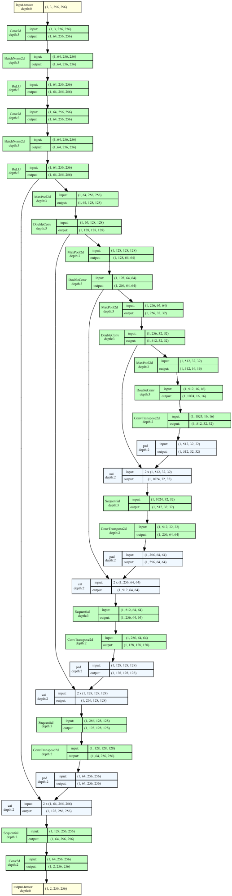

# Penjelasan Mendalam Model U-Net Standar (Standard U-Net)

> **Referensi**: Project `segmentasi-unet` — Folder `unet/` berisi implementasi U-Net standar (Ronneberger et al., 2015) yang digunakan untuk segmentasi biner daun (leaf vs background).

---

## 1. Gambaran Umum Arsitektur U-Net

U-Net adalah arsitektur **encoder-decoder** dengan **skip connections** yang dirancang khusus untuk segmentasi gambar biomedis. Arsitekturnya berbentuk huruf "U":




**Karakteristik Kunci:**
- **Encoder (Contracting Path)**: Ekstraksi fitur hierarkis via downsampling
- **Decoder (Expanding Path)**: Upsampling + rekonstruksi detail spasial
- **Skip Connections**: Menghubungkan fitur encoder ke decoder pada resolusi yang sama → mempreservasi informasi detail
- **Simetri**: Jumlah layer encoder = decoder (4 level downsampling/upsampling)

---

## 2. Lokasi Kode di Project

```
segmentasi-unet/
├── unet/
│   ├── __init__.py           # Export: from .unet_model import UNet
│   ├── unet_model.py         # Kelas utama UNet (assembly)
│   └── unet_parts.py         # Building blocks: DoubleConv, Down, Up, OutConv
├── Enhanced-U-Net/           # Versi enhanced (akan dibahas di dok terpisah)
│   ├── enhancedunet_parts.py
│   └── enhancedunet_model.py
├── utils/
│   ├── dice_score.py         # Loss function: Dice + BCE
│   ├── utils.py              # Dataset, preprocessing, visualisasi
│   └── data_loading.py       # BasicDataset, CarvanaDataset
└── Unet_Binary_Leaf_Segmentation.ipynb  # Notebook training end-to-end
```

---

## 3. Analisis Mendalam Building Blocks (`unet/unet_parts.py`)

File: `C:\Users\Musa\OneDrive - Universitas Teknologi Yogyakarta (1)\segementasi\segmentasi-unet\unet\unet_parts.py`

### 3.1 DoubleConv — Blok Fundamental

```python
class DoubleConv(nn.Module):
    """(convolution => [BN] => ReLU) * 2"""
    
    def __init__(self, in_channels, out_channels, mid_channels=None):
        super().__init__()
        if not mid_channels:
            mid_channels = out_channels
        self.double_conv = nn.Sequential(
            nn.Conv2d(in_channels, mid_channels, kernel_size=3, padding=1, bias=False),
            nn.BatchNorm2d(mid_channels),
            nn.ReLU(inplace=True),
            nn.Conv2d(mid_channels, out_channels, kernel_size=3, padding=1, bias=False),
            nn.BatchNorm2d(out_channels),
            nn.ReLU(inplace=True)
        )
    
    def forward(self, x):
        return self.double_conv(x)
```

**Detail Teknis:**
| Parameter | Nilai Default | Fungsi |
|-----------|---------------|--------|
| `kernel_size` | 3×3 | Receptive field lokal, preserve resolusi dengan padding=1 |
| `padding` | 1 | "Same" convolution → output size = input size |
| `bias` | False | BatchNorm sudah memiliki shift parameter (β), bias redundant |
| `mid_channels` | `out_channels` | Bisa di-custom untuk bottleneck channels (berguna di Enhanced U-Net) |
| `inplace=True` | ReLU | Hemat memori: overwrite input tensor |

**Mengapa 2× Conv?**
- Conv pertambah: ekspansi representasi fitur
- Conv kedua: refinemen fitur non-linear
- BN + ReLU setelah setiap conv → stabilisasi gradient, percepat konvergensi

---

### 3.2 Down — Encoder Block (Downsampling)

```python
class Down(nn.Module):
    """Downscaling with maxpool then double conv"""
    
    def __init__(self, in_channels, out_channels):
        super().__init__()
        self.maxpool_conv = nn.Sequential(
            nn.MaxPool2d(2),
            DoubleConv(in_channels, out_channels)
        )
    
    def forward(self, x):
        return self.maxpool_conv(x)
```

**Struktur:**
```
Input (C_in, H, W)
    │
    ▼
MaxPool2d(2)  ──►  (C_in, H/2, W/2)   # Stride=2, kernel=2 → downsample 2×
    │
    ▼
DoubleConv(C_in → C_out)  ──►  (C_out, H/2, W/2)
    │
    ▼
Output
```

**Channel Progression di U-Net Standar:**
| Block | In Channels | Out Channels | Resolusi (dari 256×256) |
|-------|-------------|--------------|-------------------------|
| Inc   | 3           | 64           | 256×256                 |
| Down1 | 64          | 128          | 128×128                 |
| Down2 | 128         | 256          | 64×64                   |
| Down3 | 256         | 512          | 32×32                   |
| Down4 | 512         | 1024         | 16×16                   |

**Catatan Penting**: `factor = 2 if bilinear else 1` di `unet_model.py` line 17 mengurangi channel di bottleneck saat pakai bilinear upsampling (untuk hemat memori).

---

### 3.3 Up — Decoder Block (Upsampling + Skip Connection)

```python
class Up(nn.Module):
    """Upscaling then double conv"""
    
    def __init__(self, in_channels, out_channels, bilinear=True):
        super().__init__()
        
        if bilinear:
            # Bilinear upsample + 1×1 conv untuk reduce channels
            self.up = nn.Upsample(scale_factor=2, mode='bilinear', align_corners=True)
            self.conv = DoubleConv(in_channels, out_channels, in_channels // 2)
        else:
            # Transposed convolution (learned upsampling)
            self.up = nn.ConvTranspose2d(in_channels, in_channels // 2, kernel_size=2, stride=2)
            self.conv = DoubleConv(in_channels, out_channels)
    
    def forward(self, x1, x2):
        x1 = self.up(x1)
        # input is CHW
        diffY = x2.size()[2] - x1.size()[2]
        diffX = x2.size()[3] - x1.size()[3]
        
        x1 = F.pad(x1, [diffX // 2, diffX - diffX // 2,
                        diffY // 2, diffY - diffY // 2])
        
        x = torch.cat([x2, x1], dim=1)  # Skip connection: concat di channel dimension
        return self.conv(x)
```

**Dua Mode Upsampling:**

| Mode | Implementasi | Keuntungan | Kekurangan |
|------|--------------|------------|------------|
| **Bilinear** (`bilinear=True`) | `nn.Upsample` + 1×1 conv | Deterministik, hemat parameter, cepat | Tidak belajar upsampling |
| **Transposed Conv** (`bilinear=False`) | `nn.ConvTranspose2d` | Belajar kernel upsampling, lebih fleksibel | Bisa menghasilkan *checkerboard artifacts*, lebih banyak parameter |

**Skip Connection Handling (Padding Alignment):**
```python
diffY = x2.size()[2] - x1.size()[2]  # Height difference
diffX = x2.size()[3] - x1.size()[3]  # Width difference
x1 = F.pad(x1, [diffX//2, diffX-diffX//2, diffY//2, diffY-diffY//2])
```
- Mengatasi *size mismatch* akibat padding/pooling ganjil
- `align_corners=True` pada bilinear → preserve corner pixels

**Channel Flow di Up Block (bilinear=True):**
```
x1 (from encoder, 1024 ch) ──Upsample──► (1024 ch, 2×H, 2×W)
                                                         │
x2 (skip from encoder, 512 ch) ──────────────────────────┤
                                                         ▼
                                            Concat dim=1 → (1536 ch)
                                                         │
                              DoubleConv(1536 → 512, mid=768)  # in_channels//2
                                                         │
                                                         ▼
                                                Output (512 ch)
```

---

### 3.4 OutConv — Final Classification Layer

```python
class OutConv(nn.Module):
    def __init__(self, in_channels, out_channels):
        super(OutConv, self).__init__()
        self.conv = nn.Conv2d(in_channels, out_channels, kernel_size=1)
    
    def forward(self, x):
        return self.conv(x)
```

- **1×1 Convolution**: Pointwise operation, mengubah channel dimension tanpa mengubah resolusi spasial
- **Output**: `(n_classes, H, W)` — logits per pixel per kelas
- **Tidak ada activation** → diteruskan ke loss function (CrossEntropy/Dice yang handle softmax internal)

---

## 4. Assembly Model Utama (`unet/unet_model.py`)

File: `C:\Users\Musa\OneDrive - Universitas Teknologi Yogyakarta (1)\segementasi\segmentasi-unet\unet\unet_model.py`

```python
class UNet(nn.Module):
    def __init__(self, n_channels, n_classes, bilinear=False):
        super(UNet, self).__init__()
        self.n_channels = n_channels
        self.n_classes = n_classes
        self.bilinear = bilinear
        
        # Encoder
        self.inc = DoubleConv(n_channels, 64)
        self.down1 = Down(64, 128)
        self.down2 = Down(128, 256)
        self.down3 = Down(256, 512)
        factor = 2 if bilinear else 1
        self.down4 = Down(512, 1024 // factor)
        
        # Decoder
        self.up1 = Up(1024, 512 // factor, bilinear)
        self.up2 = Up(512, 256 // factor, bilinear)
        self.up3 = Up(256, 128 // factor, bilinear)
        self.up4 = Up(128, 64, bilinear)
        self.outc = OutConv(64, n_classes)
    
    def forward(self, x):
        # Encoder path + simpan skip connections
        x1 = self.inc(x)      # (64, H, W)
        x2 = self.down1(x1)   # (128, H/2, W/2)
        x3 = self.down2(x2)   # (256, H/4, W/4)
        x4 = self.down3(x3)   # (512, H/8, W/8)
        x5 = self.down4(x4)   # (1024/factor, H/16, W/16)
        
        # Decoder path + skip connections
        x = self.up1(x5, x4)  # (512/factor, H/8, W/8)
        x = self.up2(x, x3)   # (256/factor, H/4, W/4)
        x = self.up3(x, x2)   # (128/factor, H/2, W/2)
        x = self.up4(x, x1)   # (64, H, W)
        
        logits = self.outc(x) # (n_classes, H, W)
        return logits
    
    def use_checkpointing(self):
        """Gradient checkpointing untuk hemat memori GPU"""
        self.inc = torch.utils.checkpoint(self.inc)
        self.down1 = torch.utils.checkpoint(self.down1)
        self.down2 = torch.utils.checkpoint(self.down2)
        self.down3 = torch.utils.checkpoint(self.down3)
        self.down4 = torch.utils.checkpoint(self.down4)
        self.up1 = torch.utils.checkpoint(self.up1)
        self.up2 = torch.utils.checkpoint(self.up2)
        self.up3 = torch.utils.checkpoint(self.up3)
        self.up4 = torch.utils.checkpoint(self.up4)
        self.outc = torch.utils.checkpoint(self.outc)
```

**Flow Forward Pass (contoh input 3×256×256, n_classes=2, bilinear=False):**

| Step | Layer | Output Shape | Keterangan |
|------|-------|--------------|------------|
| 0 | Input | (3, 256, 256) | RGB image |
| 1 | inc | (64, 256, 256) | DoubleConv, simpan x1 |
| 2 | down1 | (128, 128, 128) | MaxPool+DoubleConv, simpan x2 |
| 3 | down2 | (256, 64, 64) | simpan x3 |
| 4 | down3 | (512, 32, 32) | simpan x4 |
| 5 | down4 | (1024, 16, 16) | Bottleneck, simpan x5 |
| 6 | up1(x5, x4) | (512, 32, 32) | Up+Concat(x4)+DoubleConv |
| 7 | up2(x, x3) | (256, 64, 64) | Up+Concat(x3)+DoubleConv |
| 8 | up3(x, x2) | (128, 128, 128) | Up+Concat(x2)+DoubleConv |
| 9 | up4(x, x1) | (64, 256, 256) | Up+Concat(x1)+DoubleConv |
| 10 | outc | (2, 256, 256) | **Logits** per pixel (bg, leaf) |

**Gradient Checkpointing** (`use_checkpointing()`):
- Trade-off: **Komputasi ↑ 20-30%** tapi **Memori GPU ↓ 40-50%**
- Berguna untuk batch size besar / resolusi tinggi / GPU memori terbatas
- PyTorch recompute forward pass saat backward → tidak simpan activations semua layer

---

## 5. Loss Function & Training Pipeline (`utils/dice_score.py`, Notebook)

### 5.1 Dice Loss + BCE (Kombinasi)

File: `utils/dice_score.py`

```python
def dice_coeff(input, target, reduce_batch_first=False, epsilon=1e-6):
    # Dice = 2×|X∩Y| / (|X| + |Y|)
    inter = 2 * (input * target).sum(dim=sum_dim)
    sets_sum = input.sum(dim=sum_dim) + target.sum(dim=sum_dim)
    sets_sum = torch.where(sets_sum == 0, inter, sets_sum)  # handle empty
    return (inter + epsilon) / (sets_sum + epsilon)

def dice_loss(input, target, multiclass=False):
    fn = multiclass_dice_coeff if multiclass else dice_coeff
    return 1 - fn(input, target, reduce_batch_first=True)
```

**Notebook Implementation** (cell 10, `Unet_Binary_Leaf_Segmentation.ipynb`):

```python
def combined_loss(pred, target):
    # Class weighting inverse frequency
    n_fg = (target == 1).sum().float()
    n_bg = (target == 0).sum().float()
    total = n_fg + n_bg
    w_fg = (total / (2 * n_fg + 1e-6)).clamp(0.3, 3.0)
    w_bg = (total / (2 * n_bg + 1e-6)).clamp(0.3, 3.0)
    weight = torch.tensor([w_bg, w_fg], device=pred.device)
    
    bce = F.cross_entropy(pred, target, weight=weight)
    prob = F.softmax(pred, dim=1)[:, 1]  # foreground probability
    dice = dice_loss(prob, target.float(), multiclass=False)
    return bce + dice
```

**Mengapa Kombinasi BCE + Dice?**
| Loss | Kelebihan | Kekurangan |
|------|-----------|------------|
| **BCE (CrossEntropy)** | Stabil di awal training, per-pixel | Tidak handle class imbalance baik |
| **Dice Loss** | Optimasi langsung IoU/Dice, robust imbalance | Kurang stabil di awal (gradient kecil saat overlap kecil) |
| **BCE + Dice** | Best of both worlds | Perlu tuning weight (di sini 1:1) |

**Class Weighting Strategy:**
- `weight = inverse_frequency` → foreground (daun) mendapat bobot lebih tinggi
- `clamp(0.3, 3.0)` → mencegah weight ekstrem yang destabilkan training

---

### 5.2 Optimizer & Scheduler (Notebook cell 16)

```python
optimizer = optim.RMSprop(
    model.parameters(), 
    lr=1e-5, 
    weight_decay=1e-8, 
    momentum=0.999, 
    foreach=False, 
    eps=1e-8
)

scheduler = optim.lr_scheduler.ReduceLROnPlateau(
    optimizer, 'max', patience=5, min_lr=1e-7
)
```

| Komponen | Setting | Alasan |
|----------|---------|--------|
| **Optimizer** | RMSprop | Adaptive LR, cocok untuk segmentasi, stabil |
| **LR** | 1e-5 | Kecil karena pretrained/transfer learning context |
| **Weight Decay** | 1e-8 | Regularisasi ringan |
| **Momentum** | 0.999 | Smoothing update |
| **Scheduler** | ReduceLROnPlateau | Turunkan LR saat metric (Dice) plateau |
| **Patience** | 5 epochs | Tunggu 5 epoch tidak improve |
| **Min LR** | 1e-7 | Floor learning rate |

---

### 5.3 Mixed Precision Training (AMP)

```python
scaler = torch.amp.GradScaler('cuda', enabled=AMP)  # AMP=True

with torch.autocast(device.type, enabled=AMP):
    pred = model(imgs)
    loss = combined_loss(pred, masks)

scaler.scale(loss).backward()
scaler.unscale_(optimizer)
grad_norm = torch.nn.utils.clip_grad_norm_(model.parameters(), 1.0)
scaler.step(optimizer)
scaler.update()
```

**Keuntungan AMP (Automatic Mixed Precision):**
- **Memori ↓ ~50%** (FP16 untuk forward/activations)
- **Throughput ↑ ~1.5-2×** (Tensor Cores di GPU modern)
- **Numerical stability** via loss scaling (GradScaler)

---

## 6. Dataset & Preprocessing (`utils/data_loading.py`, Notebook)

### 6.1 BasicDataset (Generic)

```python
class BasicDataset(Dataset):
    def __init__(self, images_dir, mask_dir, scale=1.0, mask_suffix='', target_size=None):
        # Auto-scan mask values untuk mapping ke class index
        # Support: .png, .jpg, .npy, .pt/.pth
```

### 6.2 BinaryLeafDataset (Notebook cell 7) — Wrapper untuk Binary Segmentation

```python
class BinaryLeafDataset(Dataset):
    """Wrapper mengubah mask multi-class (0-27) jadi binary (0=bg, 1=leaf)"""
    
    def preprocess_mask(self, pil_img):
        mask = np.asarray(pil_img, dtype=np.int64)
        binary = (mask > 0).astype(np.int64)  # Semua > 0 → 1 (daun)
        return binary
```

**Pipeline Preprocessing:**
```
Raw Image (H, W, 3)          Raw Mask (H, W) values 0-27
      │                              │
      ▼                              ▼
Resize 256×256 (BICUBIC)      Resize 256×256 (NEAREST)
      │                              │
      ▼                              ▼
Normalize / 255.0            Binary threshold (>0 → 1)
      │                              │
      ▼                              ▼
Tensor (3, 256, 256)         Tensor (256, 256) long
```

---

## 7. Metrik Evaluasi

### 7.1 Binary Metrics (Notebook cell 12)

```python
def binary_metrics(pred_mask, true_mask, eps=1e-8):
    inter = (pred_mask & true_mask).sum().float()
    union = (pred_mask | true_mask).sum().float()
    iou = inter / (union + eps)
    dice = (2 * inter) / (pred_mask.sum() + true_mask.sum() + eps)
    return iou.item(), dice.item()
```

| Metrik | Rumus | Range | Interpretasi |
|--------|-------|-------|--------------|
| **IoU (Jaccard)** | \|A∩B\| / \|A∪B\| | [0, 1] | Overlap area / union area |
| **Dice (F1)** | 2\|A∩B\| / (\|A\|+\|B\|) | [0, 1] | Harmonic mean precision/recall |

**Relasi**: Dice = 2×IoU / (1 + IoU) → Dice selalu ≥ IoU

---

## 8. Hasil Training (Dari Notebook)

| Epoch | Train Loss | Val IoU | Val Dice | Status |
|-------|------------|---------|----------|--------|
| 1 | 1.7035 | 0.3520 | 0.5163 | ★ Best |
| 3 | 0.0878 | 0.4933 | 0.6295 | ★ Best |
| 4 | 0.1546 | 0.6384 | 0.7730 | ★ Best |
| 5 | 0.1275 | 0.9094 | 0.9525 | ★ Best |
| 7 | 0.1083 | 0.9261 | **0.9615** | ★ **Best Overall** |
| 22 | Early Stop | 0.0000 | 0.0000 | Stop (patience=15) |

**Best Model**: `checkpoints/best_binary.pth` — **Dice: 0.9615, IoU: 0.9261**

---

## 9. Titik Modifikasi untuk Enhanced U-Net / U-Net++

Berikut adalah **lokasi kode spesifik** yang perlu dimodifikasi untuk upgrade ke arsitektur lebih lanjut:

### 9.1 Enhanced U-Net (Attention Gates, Residual Blocks, dll.)

| Target Modifikasi | File | Kelas/Method | Deskripsi |
|-------------------|------|--------------|-----------|
| **Attention Gate** | `unet_parts.py` | Baru: `AttentionGate` | Di skip connection sebelum concat di Up block |
| **Residual DoubleConv** | `unet_parts.py` | `DoubleConv` | Tambah skip connection internal (ResNet-style) |
| **Deep Supervision** | `unet_model.py` | `UNet.forward` | Output auxiliary loss di setiap decoder level |
| **Dropout/Spatial Dropout** | `unet_parts.py` | `DoubleConv`, `Down`, `Up` | Regularisasi tambahan |

**Contoh: Menambah Attention Gate di Up Block**
```python
# Di unet_parts.py — tambah class baru
class AttentionGate(nn.Module):
    def __init__(self, F_g, F_l, F_int):
        super().__init__()
        self.W_g = nn.Sequential(
            nn.Conv2d(F_g, F_int, kernel_size=1, bias=True),
            nn.BatchNorm2d(F_int)
        )
        self.W_x = nn.Sequential(
            nn.Conv2d(F_l, F_int, kernel_size=1, bias=True),
            nn.BatchNorm2d(F_int)
        )
        self.psi = nn.Sequential(
            nn.Conv2d(F_int, 1, kernel_size=1, bias=True),
            nn.BatchNorm2d(1),
            nn.Sigmoid()
        )
        self.relu = nn.ReLU(inplace=True)
    
    def forward(self, g, x):
        g1 = self.W_g(g)
        x1 = self.W_x(x)
        psi = self.relu(g1 + x1)
        psi = self.psi(psi)
        return x * psi

# Modifikasi Up.forward:
def forward(self, x1, x2):
    x1 = self.up(x1)
    # ... padding ...
    # ATTENTION GATE di sini:
    x2 = self.att_gate(x1, x2)  # x1=g (decoder), x2=x (encoder skip)
    x = torch.cat([x2, x1], dim=1)
    return self.conv(x)
```

### 9.2 U-Net++ (Nested Skip Connections)

U-Net++ menambahkan **nested dense skip connections** antar level decoder:

```
Standard U-Net:          U-Net++:
x4 ──► Up1 ──► x3           x4 ──► Up1_0 ──► x3_0
                          ╱    │
x3 ──► Up2 ──► x2         ╱     ▼
                      x3_1 ◄── Up1_1
                          ╱    │
x2 ──► Up3 ──► x1         ╱     ▼
                      x2_2 ◄── Up2_1
                          ╱
x1 ──► Up4 ──► x0         ╱
                      x1_3 ◄── Up3_1
```

**Implementasi memerlukan restructure signifikan `unet_model.py`:**
- Ganti linear decoder dengan **nested ModuleList**
- Setiap level decoder memiliki multiple upsampling paths
- Deep supervision: loss di setiap output nested level

---

## 10. Checklist Tuning & Eksperimen

### 10.1 Hyperparameter yang Bisa Di-tune

| Kategori | Parameter | Range Saran | Lokasi |
|----------|-----------|-------------|--------|
| **Arsitektur** | Base channels (64) | 32, 64, 128 | `unet_model.py` line 13 |
| **Arsitektur** | Depth (4 levels) | 3, 4, 5 | `unet_model.py` down1-down4 |
| **Arsitektur** | Bilinear vs Transposed | True/False | `UNet.__init__` arg |
| **Loss** | BCE:Dice weight | 0.5:0.5, 0.3:0.7, 1:0 | Notebook `combined_loss` |
| **Loss** | Class weight clamp | (0.1, 5.0) | Notebook `combined_loss` |
| **Optimizer** | LR | 1e-3 ~ 1e-6 | Notebook `optimizer` |
| **Optimizer** | Weight decay | 1e-4 ~ 1e-8 | Notebook `optimizer` |
| **Training** | Batch size | 4, 8, 16, 32 | Notebook `BATCH_SIZE` |
| **Training** | Image size | 256, 384, 512 | Notebook `IMG_SIZE` |
| **Regularisasi** | Dropout rate | 0.1 ~ 0.5 | (tambah di `DoubleConv`) |
| **Regularisasi** | Label smoothing | 0.0 ~ 0.1 | (tambah di loss) |

### 10.2 Eksperimen Prioritas Tinggi

1. **Bilinear vs Transposed Conv** — Bandingkan kualitas + speed
2. **Base Channel 64 vs 128** — Trade-off kapasitas vs memori
3. **Deep Supervision** — Tambah auxiliary loss di decoder intermediate
4. **Attention Gates** — Fokus pada area foreground (daun)
5. **Test-Time Augmentation (TTA)** — Flip/rotate ensemble inference

---

## 11. Referensi & Sumber Belajar

| Referensi | Link | Catatan |
|-----------|------|---------|
| **Original U-Net Paper** | Ronneberger et al., MICCAI 2015 | Arsitektur dasar |
| **U-Net++ Paper** | Zhou et al., 2018 | Nested skip connections |
| **Attention U-Net** | Oktay et al., 2018 | Attention gates |
| **PyTorch U-Net Implementasi** | milesial/Pytorch-UNet | Base code reference project ini |
| **Medium Article** | Oleg Belkovskiy, "Enhancing U-Net" | Transfer learning, enhancements |

---

## 12. Quick Reference: Import & Usage

```python
# Import U-Net standar
from unet import UNet

# Inisialisasi
model = UNet(
    n_channels=3,      # RGB input
    n_classes=2,       # Binary: background + leaf
    bilinear=False     # Transposed conv upsampling
)

# Forward pass
logits = model(input_tensor)  # (B, 2, H, W) — raw logits

# Prediksi
pred_mask = logits.argmax(dim=1)  # (B, H, W) — class index per pixel

# Gradient checkpointing (hemat memori)
model.use_checkpointing()

# Device
model.to(device)
model.to(memory_format=torch.channels_last)  # Optimasi memori NHWC
```

---

## 13. File Terkait di Project

| File | Deskripsi |
|------|-----------|
| `unet/unet_parts.py` | **Building blocks**: DoubleConv, Down, Up, OutConv |
| `unet/unet_model.py` | **Assembly**: Kelas UNet utama, forward pass, checkpointing |
| `utils/dice_score.py` | **Loss**: Dice coefficient, Dice loss, multiclass support |
| `utils/data_loading.py` | **Dataset**: BasicDataset, CarvanaDataset, preprocessing |
| `utils/utils.py` | **Utils**: Visualisasi `plot_img_and_mask` |
| `Unet_Binary_Leaf_Segmentation.ipynb` | **End-to-end**: Data loading, training, evaluasi, watershed |
| `Enhanced-U-Net/enhancedunet_parts.py` | **(WIP)** Enhanced building blocks |
| `Enhanced-U-Net/enhancedunet_model.py` | **(WIP)** Enhanced model assembly |

---


> **Catatan**: Dokumentasi ini dibuat berdasarkan codebase `segmentasi-unet` branch `train_config` per Juli 2026. Untuk modifikasi ke Enhanced U-Net atau U-Net++, mulai dari memahami `unet_parts.py` dan `unet_model.py` sebagai fondasi.